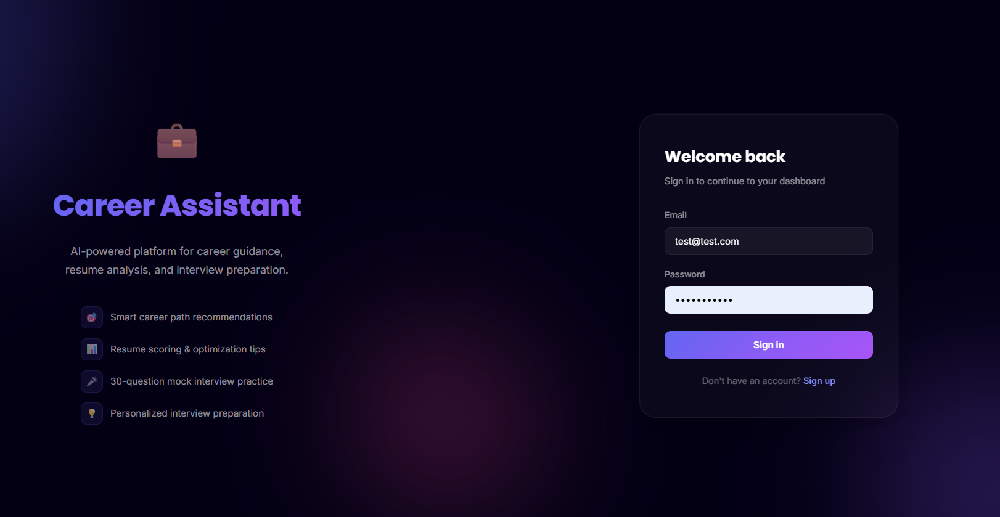
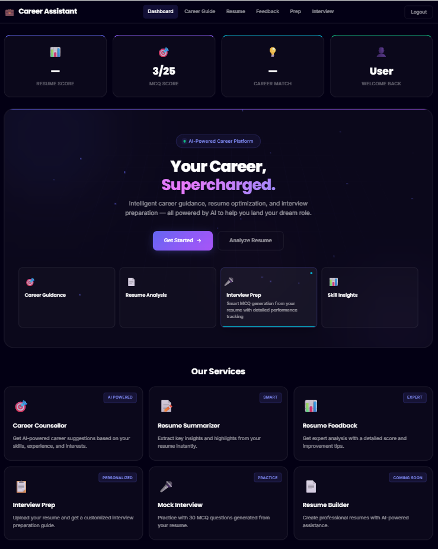
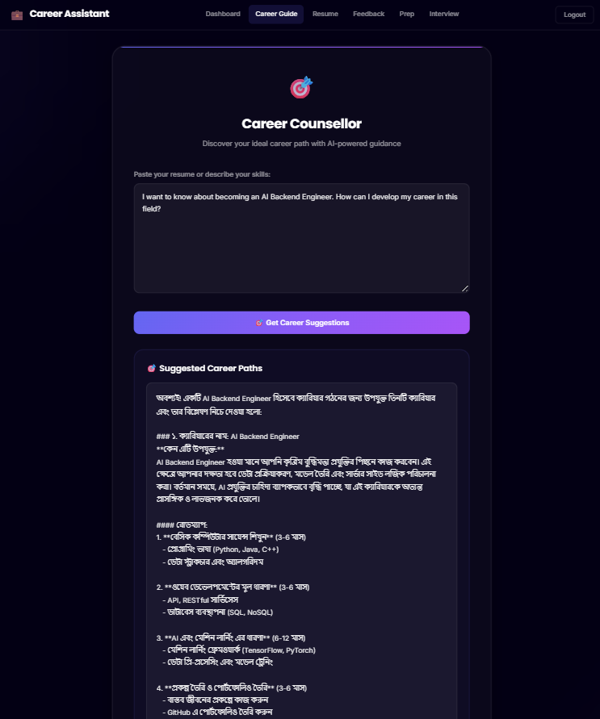
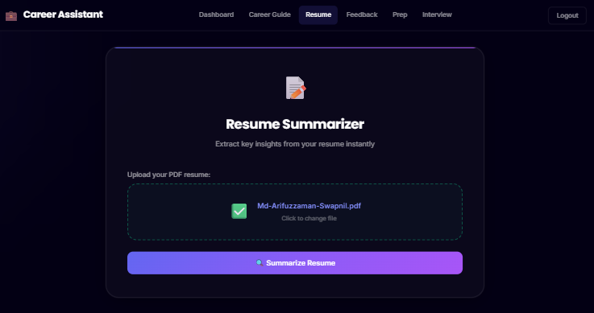
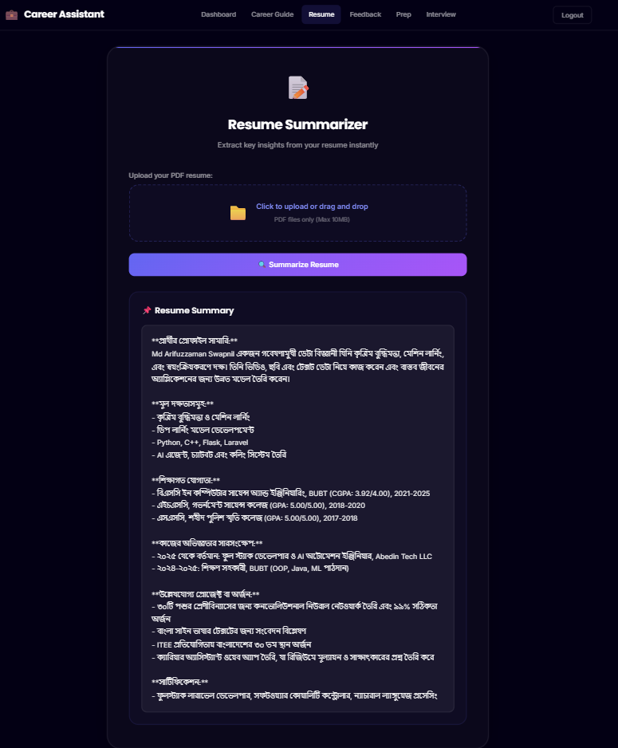
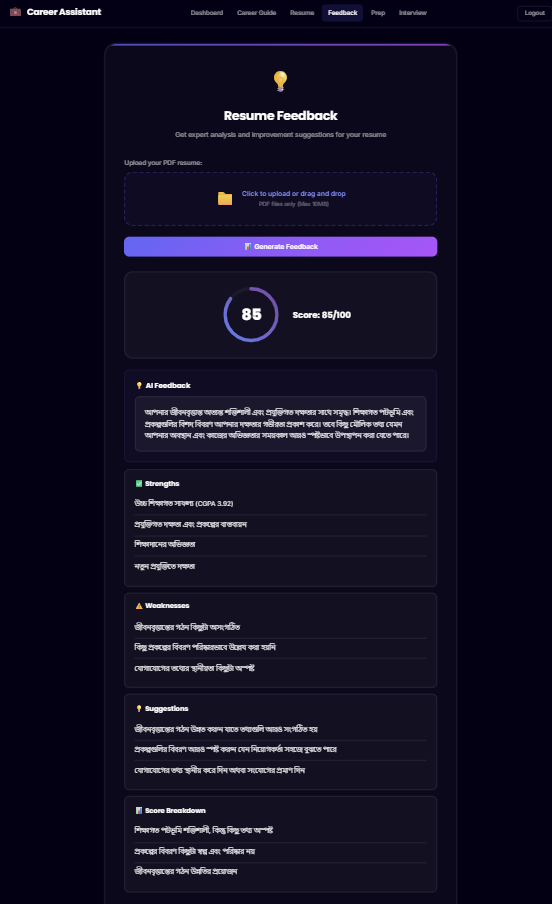

# AI Career Assistant

A full-stack AI-powered career platform built with **React TypeScript** and **Python Flask**. It provides intelligent career guidance, resume analysis, and interview preparation — all powered by **OpenAI GPT-4o-mini** with responses in **Bangla (Bengali)**.


---

## Screenshots & Features

### 1. Login Page — Secure Authentication



The login page features a **split-panel design** inspired by modern SaaS platforms like Vercel and Linear:

- **Left panel** — Brand showcase with the Career Assistant logo, tagline, and a feature highlights list (smart career recommendations, resume scoring, mock interviews, and personalized prep)
- **Right panel** — Clean login/register form with email and password fields
- **Firebase Authentication** — Secure sign-in and sign-up powered by Firebase Auth. User sessions are maintained on both client (Firebase) and server (Flask session)
- **Animated background** — Subtle blob animations and glassmorphism effects create a premium dark-theme experience
- Fully responsive: on mobile, the branding panel hides and the form takes the full screen

---

### 2. Dashboard — Your Career Command Center



The dashboard is the central hub of the application, giving users an at-a-glance overview of their progress:

- **Stats Cards** (top row) — Four color-coded metric cards showing:
  - **Resume Score** — Your latest AI-generated resume rating out of 100
  - **MCQ Score** — Your most recent mock interview score (e.g., 3/25)
  - **Career Match** — AI-assessed career compatibility percentage
  - **Welcome Back** — Personalized greeting with your name
- **Hero Section** — Premium animated section with:
  - Floating particles and pulsing glow orbs in the background
  - Animated scrolling grid pattern
  - "AI-Powered Career Platform" badge with live green indicator
  - **"Your Career, Supercharged."** — Gradient-animated headline
  - CTA buttons: "Get Started" and "Analyze Resume"
  - **4 interactive feature cards** that auto-rotate every 4 seconds — Career Guidance, Resume Analysis, Interview Prep, and Skill Insights. Click any card to expand its description
- **Our Services Grid** — Six service cards linking to each tool:
  - Career Counsellor (AI Powered)
  - Resume Summarizer (Smart)
  - Resume Feedback (Expert)
  - Interview Prep (Personalized)
  - Mock Interview (Practice)
  - Resume Builder (Coming Soon)

---

### 3. Career Counsellor — AI-Powered Career Guidance



The Career Counsellor is an AI-driven advisor that provides **detailed career path recommendations in Bangla**:

- **How it works** — Type your career question, skills, or interests into the text area. For example: *"I want to know about becoming an AI Backend Engineer. How can I develop my career in this field?"*
- **AI Response** — GPT-4o-mini analyzes your input and generates a comprehensive career guide including:
  - **Suggested Career Paths** — Multiple career options tailored to your query
  - **Why each career fits** — Detailed reasoning based on your skills and current market trends
  - **Step-by-step Roadmap** — A phased learning plan with timelines (e.g., 3-6 months per phase)
  - **Technologies to learn** — Specific programming languages, frameworks, and tools
  - **Action items** — Practical next steps like building a portfolio on GitHub, contributing to open source, etc.
- All AI outputs are in **Bangla (Bengali)** for native-language accessibility
- The response uses structured markdown formatting with headers, bullet points, and bold text for easy reading

---

### 4. Resume Summarizer — Instant Resume Analysis

<p>
  
</p>

Upload your PDF resume and the AI instantly extracts and summarizes the key information:

- **Drag & Drop Upload** — Simply drag your PDF file or click to browse. Supports files up to 10MB
- **File Validation** — Only PDF files are accepted, with visual confirmation (green checkmark) when a file is selected
- **One-click Analysis** — Hit "Summarize Resume" and the AI processes your resume in seconds

<p>
  
</p>

The AI-generated summary (in Bangla) includes:

- **Profile Overview** — A concise professional summary of who you are
- **Core Competencies** — Key skills extracted: AI/ML, machine learning, deep learning, Python, C++, Flask, Laravel
- **Education History** — Degrees, institutions, GPAs, and graduation years
- **Work Experience** — Internships, jobs, and notable projects
- **Achievements & Awards** — Competition results, certifications, and recognition (e.g., ITEE competition rankings, 30+ MCQ portfolio creation)
- **Technical Skills** — Full-stack development, AI agent development, chatbot creation

This tool is perfect for quickly understanding a resume's highlights without reading the entire document.

---

### 5. Resume Feedback — AI Scoring & Improvement Tips



The most comprehensive tool in the platform — get a detailed AI-powered analysis of your resume:

- **Score Circle** — An animated SVG circle that fills up to show your score. In this example: **85/100** with a purple gradient stroke
- **AI Feedback** — A paragraph-length assessment of your resume's overall quality, highlighting what stands out and what needs work
- **Strengths** — What your resume does well:
  - High academic results (CGPA 3.92)
  - Diverse skills and technology expertise
  - Academic achievements and awards
  - Relevant work experience
- **Weaknesses** — Areas that need improvement:
  - Professional experience section could be more detailed
  - Some sections lack specific measurable outcomes
  - Volunteering and extracurricular activities could be highlighted more
- **Suggestions** — Actionable improvement tips:
  - Add more quantifiable metrics to experience descriptions
  - Include specific project outcomes and impact numbers
  - Highlight volunteer work more prominently
- **Score Breakdown** — Detailed reasoning behind each scoring component:
  - Education quality, skills relevance, experience depth, overall presentation

Every section is displayed in **Bangla** with clear visual hierarchy using cards, icons, and color-coded sections.

---

## Tech Stack

| Layer | Technology | Purpose |
|-------|-----------|---------|
| **Frontend** | React 19 + TypeScript + Vite 7 | SPA with type safety and fast HMR |
| **Backend** | Python Flask | REST API server with JSON responses |
| **AI/LLM** | OpenAI GPT-4o-mini | Career advice, resume analysis, MCQ generation |
| **Auth** | Firebase Authentication | Email/password sign-in and sign-up |
| **Database** | Firebase Firestore | User data, scores, and session storage |
| **PDF Processing** | PyMuPDF (fitz) | Extract text from uploaded PDF resumes |
| **Styling** | Custom CSS | Premium dark theme with glassmorphism and animations |
| **HTTP Client** | Axios | API communication with interceptors |

---

## Project Structure

```
career_assistant/
├── app/                          # Flask Backend
│   ├── __init__.py               # App factory (Flask + CORS)
│   ├── openai_api.py             # OpenAI API wrapper (json_mode support)
│   ├── firebase_config.py        # Firebase Admin SDK setup
│   ├── pdf_utils.py              # PDF text extraction with PyMuPDF
│   └── routes/
│       ├── auth_routes.py        # Login / Logout / Status
│       ├── dashboard_routes.py   # User stats & metrics
│       └── ai_routes.py          # All AI tools (career, resume, interview)
├── frontend/                     # React + TypeScript Frontend
│   ├── src/
│   │   ├── App.tsx               # Router & protected routes
│   │   ├── index.css             # Complete design system (~1400 lines)
│   │   ├── context/
│   │   │   └── AuthContext.tsx    # Firebase auth state provider
│   │   ├── services/
│   │   │   └── api.ts            # Axios client (auto-proxied to Flask)
│   │   ├── components/
│   │   │   ├── FileUpload.tsx     # Drag & drop PDF upload
│   │   │   └── Layout/
│   │   │       └── Navbar.tsx     # Responsive navigation
│   │   ├── pages/
│   │   │   ├── Login.tsx          # Split-panel login/register
│   │   │   ├── Dashboard.tsx      # Stats + animated hero + services
│   │   │   ├── CareerCounselor.tsx
│   │   │   ├── ResumeSummarizer.tsx
│   │   │   ├── ResumeFeedback.tsx # Animated SVG score circle
│   │   │   ├── InterviewPrep.tsx
│   │   │   └── MockInterview.tsx  # 30 MCQ quiz with timer
│   │   └── types/
│   │       └── index.ts          # TypeScript interfaces
│   ├── package.json
│   ├── tsconfig.json
│   └── vite.config.ts            # Dev proxy: /api → Flask:5000
├── screenshots/                  # App screenshots for README
├── requirements.txt
├── run.py                        # Flask entry point
└── .gitignore
```

---

## Getting Started

### Prerequisites

- Python 3.9+
- Node.js 20+
- Firebase project with Auth & Firestore enabled
- OpenAI API key

### 1. Clone the repository

```bash
git clone https://github.com/Arifuzzaman-Swapnil/AiCareerAgent.git
cd AiCareerAgent
```

### 2. Setup Backend

```bash
# Create virtual environment
python -m venv venv

# Activate (Windows)
venv\Scripts\activate

# Activate (macOS/Linux)
source venv/bin/activate

# Install dependencies
pip install -r requirements.txt
```

### 3. Configure Environment

Create a `.env` file in the project root:

```env
OPENAI_API_KEY=your_openai_api_key_here
```

Place your Firebase service account JSON file as `firebase_service_account.json` in the project root.

### 4. Setup Frontend

```bash
cd frontend
npm install
```

### 5. Run the Application

**Terminal 1 — Backend (Flask):**
```bash
python run.py
```
Flask runs on `http://localhost:5000`

**Terminal 2 — Frontend (Vite):**
```bash
cd frontend
npm run dev
```
Frontend runs on `http://localhost:5173` (auto-proxies `/api` to Flask)

---

## API Endpoints

| Method | Endpoint | Description |
|--------|----------|-------------|
| POST | `/api/auth/login` | Firebase login + server session |
| POST | `/api/auth/logout` | Clear session |
| GET | `/api/auth/status` | Check authentication status |
| GET | `/api/dashboard` | Get user stats (scores, name) |
| POST | `/api/tools/career` | AI career counselling |
| POST | `/api/tools/resume/summarize` | Resume PDF summarization |
| POST | `/api/tools/resume/feedback` | Resume feedback with score |
| POST | `/api/tools/interview/prep` | Interview preparation guide |
| POST | `/api/tools/interview/generate` | Generate 30 MCQ questions |
| GET | `/api/tools/interview/questions` | Retrieve generated questions |
| POST | `/api/tools/interview/submit` | Submit MCQ answers |
| GET | `/api/tools/interview/results` | Get detailed results |

---

## Design Highlights

- **Premium Dark Theme** — Near-black (`#030014`) background with indigo (`#6366f1`) accent
- **Glassmorphism Cards** — Frosted glass effect with `backdrop-filter: blur()` and subtle borders
- **Animated Hero** — Floating particles, pulsing glow orbs, scrolling grid, and staggered text reveal
- **Split-Panel Login** — SaaS-style layout with branding left and form right
- **SVG Score Animation** — Circular progress indicator with gradient stroke for resume scoring
- **Responsive** — Desktop, tablet, and mobile breakpoints (1024px, 768px, 480px)
- **Typography** — Inter (body) + Poppins (headings) from Google Fonts
- **Custom Scrollbar** — Styled to match the dark theme

---

## License

This project is open source and available under the [MIT License](LICENSE).

---

<p align="center">
  <b>Built with OpenAI GPT-4o-mini, React, TypeScript, and Flask</b>
</p>
